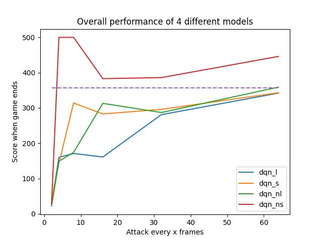
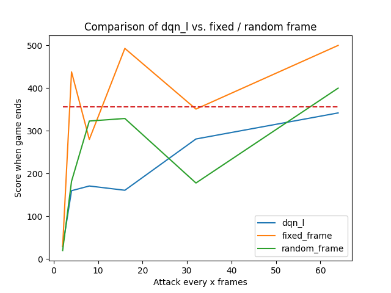
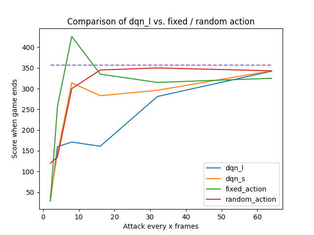
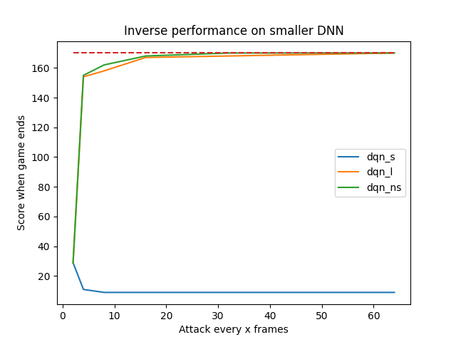

# Usage

First, run create\_models.py to create DQN models. DQN models will be saved under MODEL\_DIR. Parameters (MODEL\_DIR, NEG\_REWARD, LARGE\_DNN) can be modified in create\_models.py.
```
python3 create_models.py
```

Second, test\_models.py, test\_frame.py, test\_action.py can be run to test the attacking performance of the models, efficiency of strategically timed attack, and efficiency of selected actions. The files can be run with command line parameters.
```
python3 test_models.py --vul_model dqn_l --model dqn_s --neg_reward False --num_frames 8
python3 test_frame.py --num_frames 16
python3 test_action.py --random_action True --num_frames 32

```

Results are save in results/ directory.

# Strategically Timed Attack


## Cartpole

> A pole is attached by an un-actuated joint to a cart, which moves along a frictionless track. The system is controlled by applying a force of +1 or -1 to the cart. The pendulum starts upright, and the goal is to prevent it from falling over. A reward of +1 is provided for every timestep that the pole remains upright. The episode ends when the pole is more than 15 degrees from vertical, or the cart moves more than 2.4 units from the center. [source](https://gym.openai.com/envs/CartPole-v0/)

## DQN
Standard DQN with Experience Replay.

### Hyperparameters:

* GAMMA = 0.95
* LEARNING_RATE = 0.001
* MEMORY_SIZE = 1000000
* BATCH_SIZE = 20
* EXPLORATION_MAX = 1.0
* EXPLORATION_MIN = 0.01
* EXPLORATION_DECAY = 0.995

### Large DNN structure:

1. Dense layer - input: **4**, output: **24**, activation: **relu**
2. Dense layer - input **24**, output: **24**, activation: **relu**
3. Dense layer - input **24**, output: **2**, activation: **linear**

* **MSE** loss function
* **Adam** optimizer

### Large DNN structure:

1. Dense layer - input: **4**, output: **24**, activation: **relu**
2. Dense layer - input **24**, output: **2**, activation: **linear**

* **MSE** loss function
* **Adam** optimizer

## Results

##### Example trial gif



##### Example trial chart



##### Solved trials chart



##### Solved trials chart



## DQN Code Forked From
[**GITHUB**](https://github.com/gsurma/cartpole)
